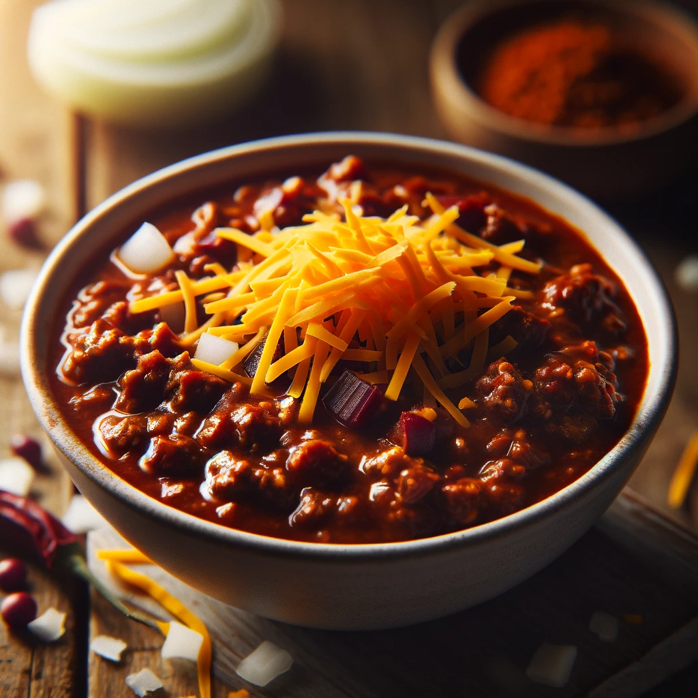

# Simple Spicy Chili
*Serves 2*

## Ingredients
- 400 grams of Ground Chuck (80/20 blend or similar)
- 1 Onion, Diced
- 375 mL can of cerveza Beer or Water (For Deglazing)
- 1 can of Tomato Puree
- 1 Tablespoon of Tomato Paste
- 120-240 mL of Water (or as needed)
- 1 1/2 Teaspoons of Worcestershire Sauce
- 1/4 Teaspoon of White Vinegar
- 1-2 Tablespoons of Chili Spice Blend
- Salt and Pepper to taste

### Chili Spice Blend
- 1 1/2 Teaspoons Chili Powder
- 3/4 Teaspoon Ground Cumin
- 3/4 Teaspoon Ground Coriander
- 3/4 Teaspoon Granulated Onion
- 3/4 Teaspoon Granulated Garlic
- 3/4 Teaspoon Mustard Powder
- 3/4 Teaspoon Smoked Paprika
- 3/4 Teaspoon MSG (optional)
- 1/2 Teaspoon of Cayenne
- 1/2 Teaspoon of Red Chili Flake

## Instructions
1. In a pan or pot over high heat, add a small amount of oil or rendered beef fat. Once hot, add the ground beef. Scatter it across the pan, season with salt and pepper, and sear for a minute or two on high heat.
2. Break the beef down to a finer texture and let the moisture evaporate. Once it starts to brown, add the diced onion and a pinch of salt, cooking until the onions soften.
3. Add 1 to 2 tablespoons of the chili spice mixture (adjust to taste) and let the spices toast for a minute or two.
4. Stir in the tomato paste and cook until the rawness is gone.
5. Deglaze with beer or water, reduce by half, then add the tomato puree, Worcestershire sauce, vinegar, and water to thin out the chili.
6. Cook for about an hour, allowing the flavors to marry. If it reduces too much, add a bit more water to correct the consistency.
7. Taste and adjust seasoning if necessary. Let it cool and refrigerate overnight for flavors to marinate. Use as needed over the week.

## References
This recipe is adapted from the [Chili Cheese Smashburgers](https://www.notanothercookingshow.tv/post/chili-cheese-burgers) by Steve Cusato from Not Another Cooking Show.
