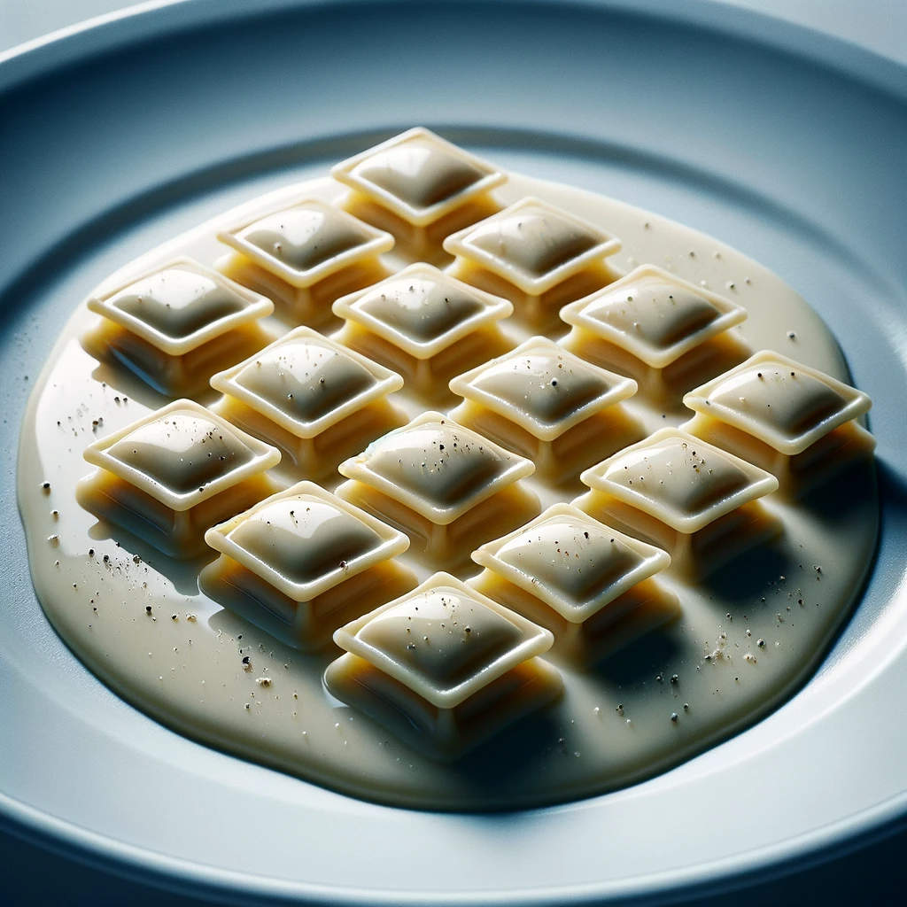

# Ravioles Du Dauphine
*Author: Steve Cusato | Not Another Cooking Show*

## Ingredients
- 1 Sheet of 6 x 8 Ravioli Sheet
- 2 Tablespoons Unsalted Butter, Cold
- 1/4- 1/2 Cup of Vin Jaune or Sherry Wine
- 1-2 oz Grated Comte
- Salt

### Creme Fraiche Filling (Enough for half the Pasta Dough)
- 8 oz, Creme Fraiche, grained of some of its moisture is ideal
- 5 oz Aged comté, grated
- 2 Tablespoons of Fresh Thyme, Chopped
- 1/4 Cup Fresh Chives, finely diced
- Salt and Pepper to taste

### Egg Pasta Dough (Enough for 16 6 X 8 Sheets)
- 454 Grams Caputo “00” Flour
- 258 Grams of Whole Eggs, Beaten

### Garnishes
- Fresh Cracked Black Pepper
- Olive oil
- Grated Comte

## Gear
- Mercato Pasta Machine
- Mercato Ravioli Stamp
- Pasta Cutter

## Instructions
### Making The Egg Pasta Dough
1. Make the Pasta (best to make a day ahead). Build a well of flour on the table and pour the beaten eggs into the center. Use a fork to beat the eggs while slowly incorporating the flour. Knead the dough, adding flour if sticky. Let it rest for 20-30 minutes.
2. After resting, knead again for about 5 minutes, then wrap in plastic. Let it rest at room temperature for 2 hours or in the fridge overnight.

### Make the Ravioli Filling
1. Combine creme fraiche, chopped herbs, salt, pepper, and grated Comte. Place in a piping bag.

### Forming The Ravioles
1. Cut and flatten a portion of the dough. Use the pasta machine to thin it out to the 7th setting.
2. Fill the ravioli stamp with pasta sheet, add the creme fraiche filling, and seal.
3. Cut into singular sheets and place on a tray with semolina.

### Cooking The Pasta and the Sauce
1. Boil pasta sheets in salted water. In a separate pan, reduce sherry wine.
2. Add butter to the pan, then add cooked pasta.
3. Drizzle in pasta water to create a creamy sauce. Incorporate the grated Comte.
4. Plate the pasta, garnish with cheese, pepper, and olive oil.