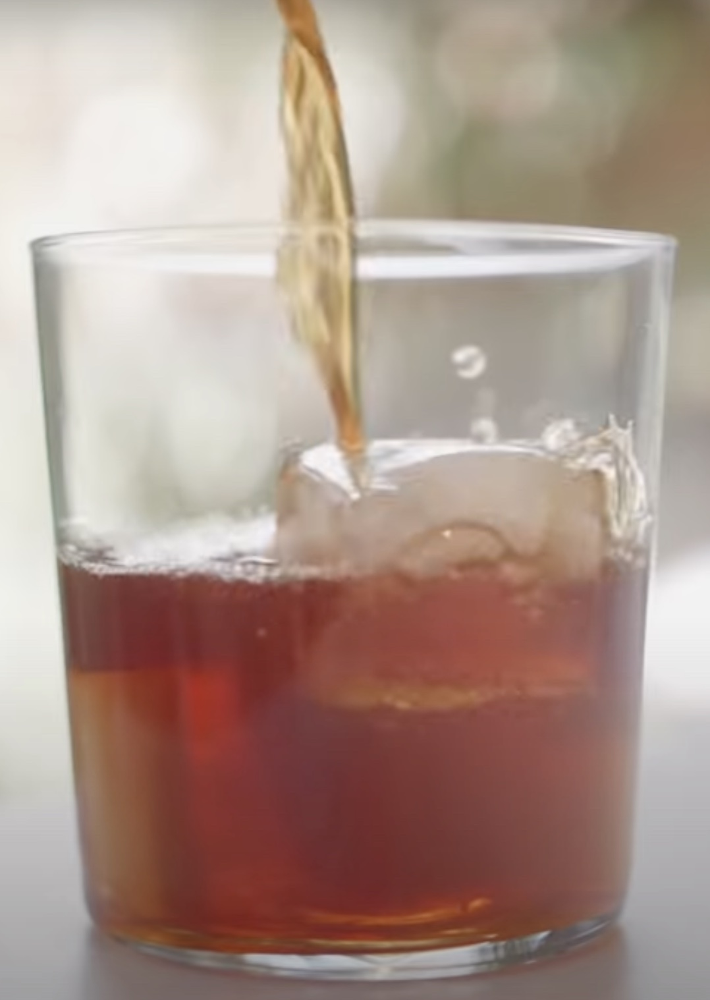

# Japanese-style Iced Coffee - アイスコーヒー

## Equipment
- Pourover dripper
- Decanter
- Pourover coffee filter
- Scale that measures grams
- Kettle

## What I Used
- [V60 ceramic coffee dripper 02](https://www.hario-usa.com/collections/drippers/products/v60-ceramic-coffee-dripper-02-classic)
- [V60 02 XGS coffee server with lid](https://www.hario-usa.com/collections/servers/products/v60-range-server?variant=32575164252293)
- [V60 paper filter, natural brown, untabbed](https://www.hario-usa.com/collections/filters/products/copy-of-paper-filter-for-01-drippers?variant=32472393416837)
- [V60 drip scale](https://www.hario-usa.com/collections/scales/products/v60-drip-scale)
- [Electric gooseneck kettle](https://www.walmart.com/ip/Willsence-Gooseneck-Kettle-Temperature-Control-Pour-Over-Electric-Coffee-Tea-100-Stainless-Steel-Inner-1200W-Rapid-Heating-0-8L-Built-in-Stopwatch-Bl/870059197?athbdg=L1700)

## Coffee for One

### Ingredients
- 120g ice
- 180g water
- 20g coffee, ground medium-fine

### Preparation
1. Heat water to 205 degrees in kettle.
2. While water is heating, place filter in dripper and rinse in sink.
3. Once water is heated, place ice in decanter and tare scale.
4. Start a timer and pour 40g of water to bloom grounds.
5. At 0:45, pour 70g of water, bringing total to 110g.
6. At 1:30, pour the final 70g of water, bringing total to 180g.
7. Stir final pour and grounds once clockwise, once counter-clockwise with spoon.
8. Remove the dripper and set aside.
9. Swirl the decanter until the remaining ice melts.
10. Pour into highball glass over additional ice and serve.

## Coffee for Two

### Ingredients
- 240g ice
- 360g water
- 40g coffee, ground medium-fine

### Preparation
1. Heat water to 205 degrees in kettle.
2. While water is heating, place filter in dripper and rinse in sink.
3. Once water is heated, place ice in decanter and tare scale.
4. Start a timer and pour 80g of water to bloom grounds.
5. At 0:45, pour 140g of water, bringing total to 220g.
6. At 1:30, pour the final 140g of water, bringing total to 360g.
7. Stir final pour and grounds once clockwise, once counter-clockwise with spoon.
8. Remove the dripper and set aside.
9. Swirl the decanter until the remaining ice melts.
10. Pour into two highball glasses over additional ice and serve.

_Adapted from [James Hoffmann's
recipe](https://www.youtube.com/watch?v=PApBycDrPo0)._